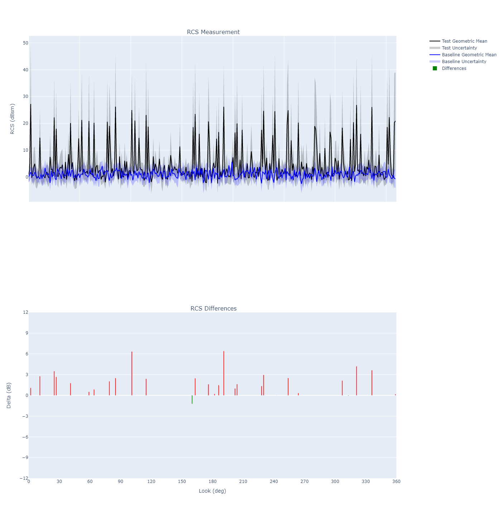

# LO Data Analysis Toolkit (LODAT)
A condensed version of tools that provide deeper insight into distributions of data to identify anomalies
***
### Assumptions
1. Data points originated from integrated radar information from t<sub>0</sub> to t<sub>1</sub>
2. Data points are independent of one another
3. Nyquist sampling rate has not been achieved
   1. Therefore, collected data is a <i>sample</i> of the true lobing structure (i.e. <i>population</i>)
   2. Random sampling theory is applicable
4. The distribution of data follows a Gaussian distribution
***
### Implementation
Data is handled in LODAT using a `DataObject` class. The class structures tabular data stored 
in a `pandas.DataFrame` by frequency and polarization
```python
# Load a data object
from lodat.data import DataObject
test = DataObject('path/to/my/test/file.csv')
base = DataObject('path/to/my/baseline/file.csv')

# Example 
freq = 1000     # MHz
pol = 'HH'      # horizontal
vector = test[freq][pol]        # pandas.DataFrame with the collected information
```

The main logic is contained in a class called `Algo`. 
```python
from lodat.analysis import Algo
algo = Algo(test, base)
result = algo.analyze(freq, pol, bootstrap=False)       # multi-index pandas.DataFrame
```

Results can be viewed with `ComboPlot` 
```python 
from lodat.plot import ComboPlot
d = 10              # depression of interest
cp = ComboPlot(result.loc[d], title='My Data')
cp.render()         # will display in default browser
```
<h5 align="center">All data</h5>


[comment]: <> (<h5 align="center">Subset of data</h5>)

[comment]: <> (![]&#40;reference/images/zoomed_plot.png&#41;)
